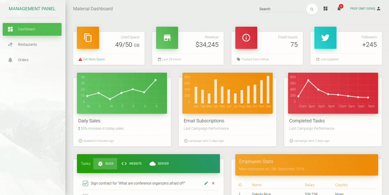

#  World of Food App (e-Commerce)

A World of Food e-commerce which created with Laravel. 
World of Food e-commerce is a highly flexible for the digital marketing business.
World of Food e-commerce is 100% responsive and looks great on every device.

## Preview - Website 

## Preview - Admin Panel

Click demo to try it by yourself!

## World of Food Demo Link

You can view the site here [Click Me](https://worldoffood)

## Topics

- Laravel
- PostgreSQL
- Bootstrap 5
- HTML5 and CSS3
- 100% responsive
- Cross browser compatibility
- On hover effects
- Call to action button
- Footer navigation
- Social media icons
- Google fonts
- Admin Panel

## Libraries & Plugins
- Laravel
- Bootstrap 5
- jQuery
- Google fonts
- Font Awesome

***
### Author

* [Ümit GENİŞ](https://github.com/umitgenis/) | [e-mail adress for click](mailto:umitgenis@gmail.com)

***
### `composer install`
### `.env => DB configuration`
### `php artisan migrate`
### `php artisan db:seed`
### `php artisan serve --port 8090`

Runs the app in the development mode.
Open http://localhost:8090 to view it in the browser.

The page will reload if you make edits.
